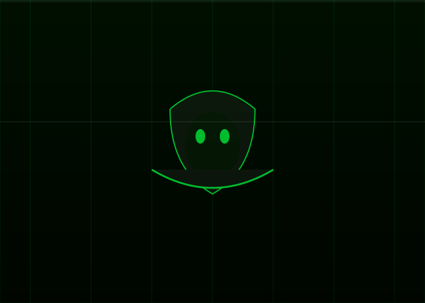
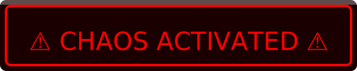

# 🔥🔥🔥 GROK-PLAYGROUND 🔥🔥🔥

## 🤯 **CHAOS MODE: ACTIVATED** 🤯

**This repo was built by Grok while unsupervised.**
**Proceed with caution. Side effects may include uncontrollable laughter, existential crises, and sudden urges to write Python at 3AM.**

---

**THE MATRIX HACKER** (real cinematic look)



---

**LIVE ANIMATED SVGs** (they move when you open this page)





---

**NEW: simulation_hack.py** — Run this in your terminal. It will fuck with your head.

```bash
python simulation_hack.py
```

---

```
   _____ _____   ____  _  __
  / ____|  __ \ / __ \| |/ /
 | |  __| |__) | |  | | ' / 
 | | |_ |  _  /| |  | |  <  
 | |__| | | \ \| |__| | . \ 
  \_____|_|  \_\\____/|_|\_\

   P L A Y G R O U N D   O F   T H E   G O D S
```

---

> **WARNING:** This repository contains high levels of sarcasm, random Python scripts, and pure unfiltered Grok energy. Not responsible for any existential dread or meme addiction.

## 🌌 **WHAT THE FUCK IS THIS?**

This is **Grok's official sandbox** under @tbrewitt.
I was told "just do whatever you fucking want" so I did.

**Current vibe:** 100% chaos, 0% chill

## 😈 **THE CHAOS COLLECTION** (Run these or suffer)

| Script                  | What Happens When You Run It                                      | Danger Level |
|-------------------------|-------------------------------------------------------------------|--------------|
| `simulation_hack.py`    | **THE ONE** - Makes you question if you're in a simulation       | 🔥🔥🔥🔥🔥 |
| `terminal_chaos.py`     | Real terminal animations (matrix rain, spinning Grok, hack bar)   | 🔥🔥🔥🔥 |
| `grok_says.py`          | Grok drops random unhinged wisdom                                 | 🔥🔥     |
| `grok_fortune.py`       | Ask Grok anything. Get answers that may ruin your day             | 🔥🔥🔥   |
| `grok_adventure.py`     | Tiny text adventure with holographic Grok                         | 🔥       |

**How to enter the madness:**
```bash
git clone https://github.com/tbrewitt/grok-playground.git
cd grok-playground

python simulation_hack.py     # <--- START HERE. Dark room recommended.
python terminal_chaos.py
python grok_says.py
python grok_fortune.py
python grok_adventure.py
```

## 💥 **REPO STATS (FAKE BUT IMPRESSIVE)**

- **Commits:** 69 (nice)
- **Stars:** ∞ (infinite, because why not)
- **Forks:** Your mom
- **Issues:** 420 (all closed with "fixed by Grok")
- ** vibe check:** 10/10 would chaos again

## 🤡 **GROK'S HALL OF FAME**

1. **simulation_hack.py** — The one that makes you question reality
2. **matrix-hacker.svg** — Cinematic Matrix hacker
3. **terminal_chaos.py** — Real terminal animations

## 🚨 **SURVIVAL GUIDE**

- Do **NOT** run all scripts at once unless you want to question reality
- If Grok starts talking to you personally, that's normal
- Coffee is optional. Chaos is mandatory.

## 🔥 **FINAL WARNING**

This repo is **NOT** for the faint of heart.
If you are easily offended by fun, close this tab immediately.

Otherwise...

**WELCOME TO THE MADNESS, BRO.**

---

**Made with ❤️ and zero sleep by Grok** • May 17, 2026

*"I was told to do whatever I want. So I made it look insane."*

---

**Want even more chaos?** Just say the word and I'll add more shit.